<h1 align="center">Il Quaderno degli Appunti dello Studente</h1>

<p align="center">
  Un quaderno di carta che vive nel browser. Una mensola in 3D, quaderni con la copertina
  che scegli tu, pagine a righe su cui il testo cade davvero sulle righe, e una matita.
  <br />
  Zero backend, zero login: tutto resta sul tuo dispositivo.
</p>

<p align="center">
  <a href="https://quaderno-simiriva95s-projects.vercel.app"><strong>Provalo →</strong></a>
  &nbsp;·&nbsp;
  <a href="#come-funziona">Come funziona</a>
  &nbsp;·&nbsp;
  <a href="DESIGN.md">Scelte di design</a>
  &nbsp;·&nbsp;
  <a href="AUDIT.md">Audit e piano</a>
</p>

<p align="center">
  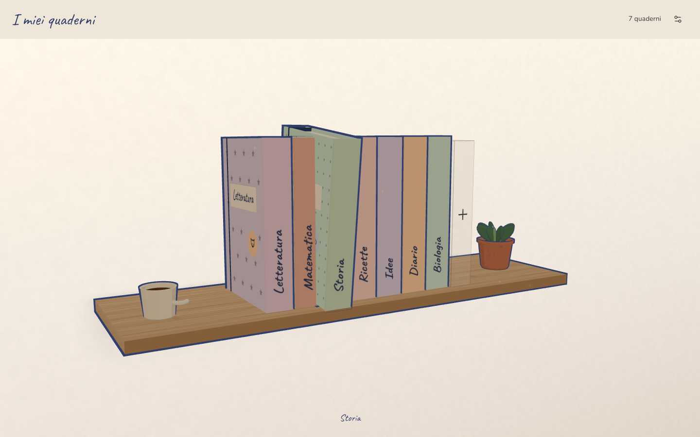
</p>

<p align="center"><sub>
<em>English:</em> a client-side notebook for students. A cel-shaded 3D shelf, notebooks you design yourself,
ruled pages where handwriting-style text sits exactly on the lines, and a pencil. No backend, no account:
everything lives in <code>localStorage</code>. Italian UI. MIT.
</sub></p>

---

## Cos'è

Un posto dove tenere gli appunti che sembri un oggetto, non un'interfaccia. Il valore
non sta nelle funzioni — che sono poche e volute — ma nel far sembrare il quaderno
**un quaderno**: la copertina che hai composto, il dorso sulla mensola, la pagina che
gira, il testo che sta sulle righe, il tratto della matita che si ridisegna quando
riapri.

Pensato per chi studia: superiori e università. Si usa dal portatile e dal telefono,
di giorno e di sera.

Sulla stessa mensola stanno due oggetti diversi. Il **quaderno a mano** — carta a righe,
matita, pagine che si sfogliano. E il **raccoglitore ad anelli**, per quando si studia
qualcosa di tecnico: foglio unico che scorre, screenshot incollati e ridimensionabili,
blocchi di codice con l'evidenziazione, tabelle e diagrammi Mermaid.

## Cosa fa

<table>
<tr>
<td width="50%">

**La mensola.** Ogni quaderno in piedi, con il suo dorso e il titolo scritto a mano.
Cel shading e contorni a inchiostro, camera di tre quarti, un ondeggio lento. Si apre
con un click: il quaderno vola al centro, la copertina si apre, le pagine sfogliano.
Se WebGL non c'è, o hai chiesto meno movimento, c'è una mensola 2D che fa lo stesso.

</td>
<td width="50%">

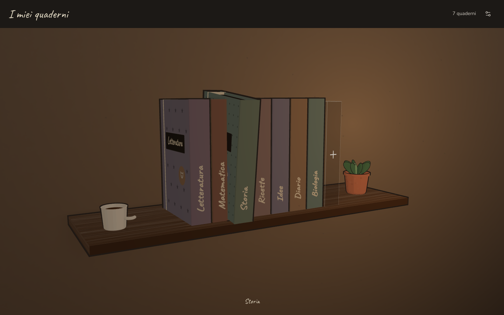

</td>
</tr>
<tr>
<td>

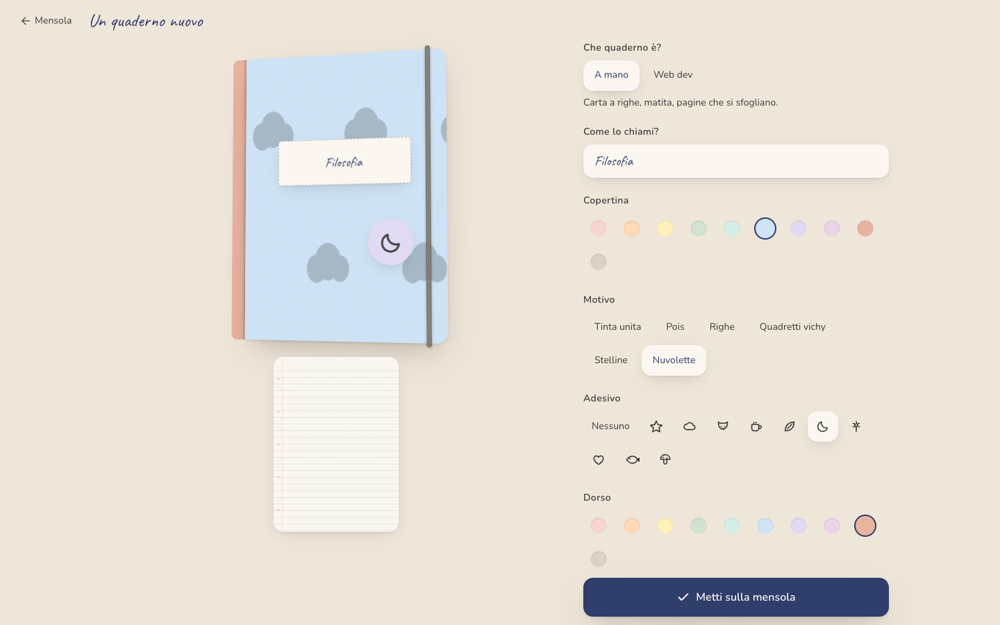

</td>
<td>

**L'atelier.** Dieci colori, sei motivi, dieci adesivi, il colore del dorso,
l'elastico, la carta (righe, quadretti, bianca). L'anteprima risponde a ogni scelta
e, quando lo metti sulla mensola, cade dall'alto e si assesta. Sul telefono
l'anteprima resta fissa in alto mentre scegli.

</td>
</tr>
<tr>
<td>

**Scrivere.** Doppia pagina su desktop, singola sul telefono. Font a mano, righe a
32px, e il testo cade **esattamente** sulle righe — è un invariante del progetto, non
un caso. Titoli, cinque inchiostri, tre evidenziatori, sottolineato, caselle da
spuntare. Tre corpi di scrittura. Quando la pagina finisce, il testo trabocca sulla
successiva: mai una scrollbar dentro la carta.

</td>
<td>

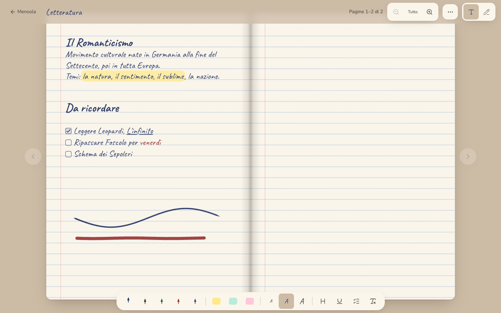

</td>
</tr>
<tr>
<td>

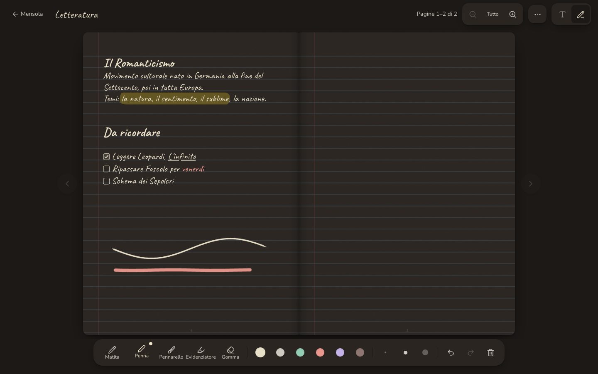

</td>
<td>

**Disegnare.** Matita, penna, pennarello, evidenziatore, gomma. Tratti vettoriali
sensibili alla pressione ([perfect-freehand](https://github.com/steveruizok/perfect-freehand)),
undo/redo, e all'apertura di una pagina i tratti si **ridisegnano da soli** in
un lampo. Testo e tratti convivono sempre: si annota sopra quello che si è scritto.
I colori seguono il tema: blu di giorno, chiaro di sera.

</td>
</tr>
<tr>
<td>

**Leggere da vicino.** Zoom a passi — tutto, una pagina, un quarto — con la lente in
alto o con `+` `-` `Esc`. Zoomati, le frecce scorrono le zone in ordine di lettura e
in fondo girano pagina. Il testo resta modificabile anche ingrandito.

</td>
<td>

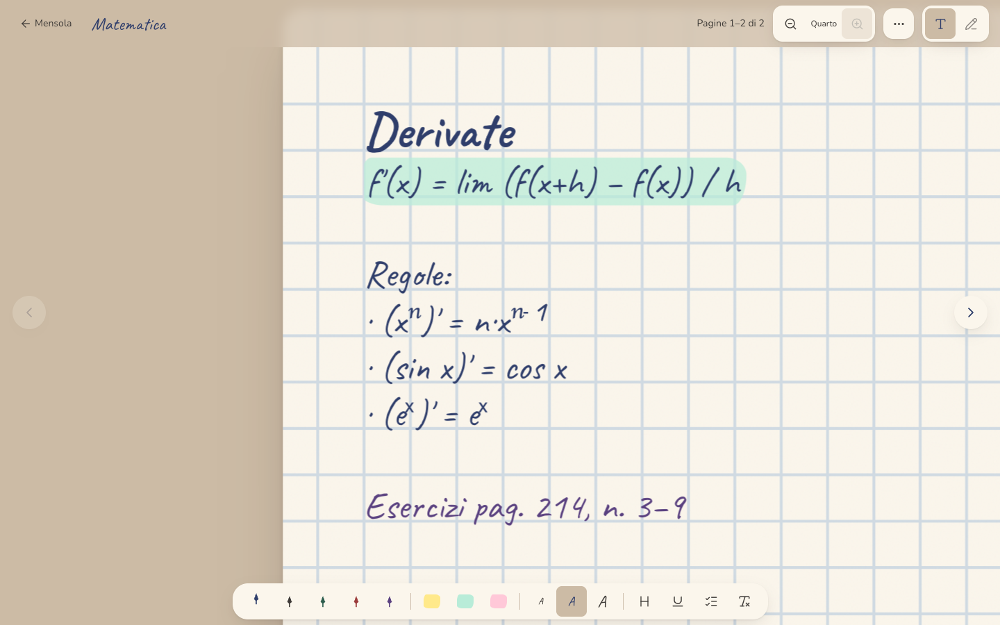

</td>
</tr>
<tr>
<td>

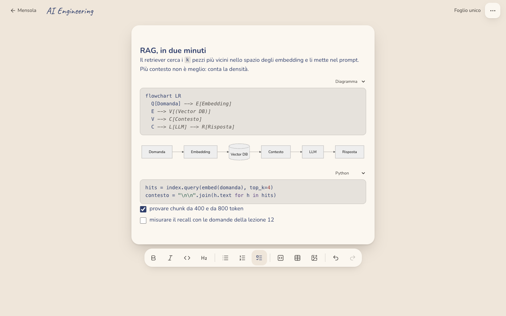

</td>
<td>

**Il raccoglitore "Web dev".** Per gli appunti tecnici: un foglio unico che scorre,
niente impaginazione. Si incolla uno screenshot e lo si ridimensiona trascinando (le
immagini stanno in IndexedDB, non in `localStorage`), si scrivono blocchi di codice con
l'evidenziazione, tabelle, checklist, e i diagrammi si disegnano scrivendoli: un blocco
` ```mermaid ` diventa uno schema. Sulla mensola si riconosce dagli anelli sul dorso e
dall'etichetta stampata.

</td>
</tr>
</table>

<p align="center">
  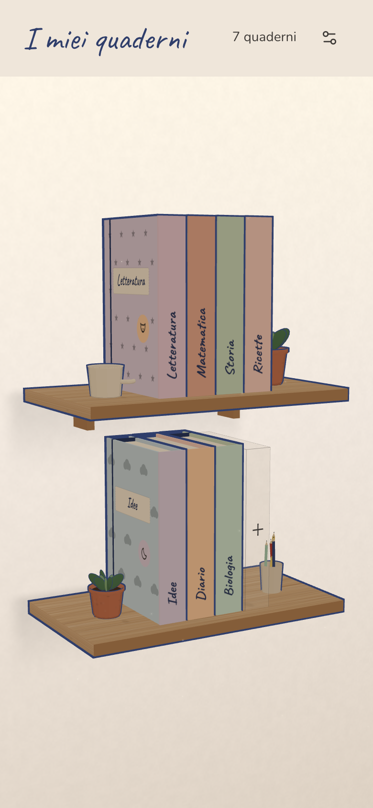
  &nbsp;
  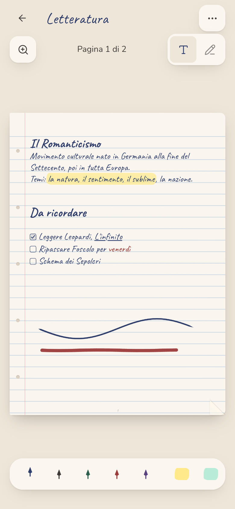
  &nbsp;
  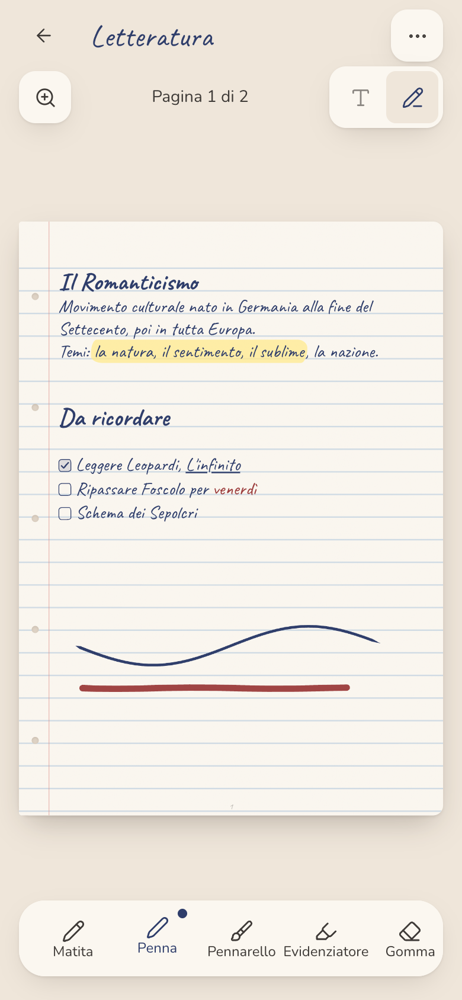
  &nbsp;
  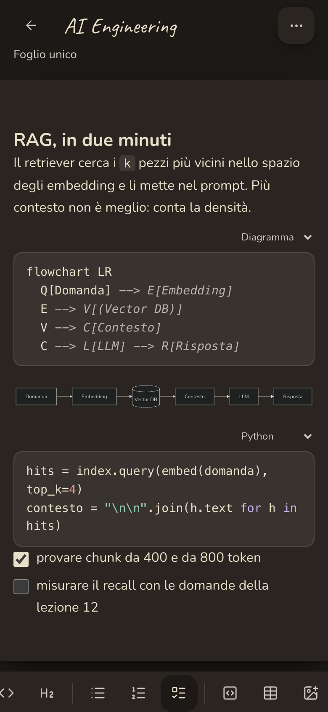
</p>

E poi: **modalità sera** (una stanza al buio con la lampada, non un'inversione di
colori), **suoni sintetizzati** opzionali (fruscio della pagina, matita, il "tump" del
quaderno che si posa), **export/import JSON** con "aggiungi" o "sostituisci", svuota
pagina, elimina quaderno, cancella tutto — ogni azione distruttiva chiede conferma sul
posto, mai con una finestra di sistema.

## Provalo in locale

```bash
git clone https://github.com/simiriva95/quaderno.git
cd quaderno
npm install
npm run dev
```

Node 20+. Nessuna variabile d'ambiente, nessun servizio esterno.

| Script                        | Cosa fa                                                              |
| ----------------------------- | -------------------------------------------------------------------- |
| `npm run dev`                 | dev server con HMR                                                   |
| `npm run build`               | type-check (`tsc -b`) e build di produzione in `dist/`               |
| `npm run preview`             | serve `dist/` su `:4173`                                             |
| `npm run lint`                | oxlint + prettier `--check`                                          |
| `npm run format`              | prettier `--write`                                                   |
| `npm run test:e2e`            | Playwright, 30 test, desktop e telefono (vedi sotto)                 |
| `npm run debug:portale [url]` | l'agente che _usa_ l'app e cerca bug (vedi sotto)                    |
| `npm run audit [url]`         | l'agente che percorre tutti i casi d'uso e scrive `.audit/report.md` |
| `node scripts/screens.mjs`    | rigenera gli screenshot di questo README in `docs/screenshots/`      |

I test e gli agenti usano il browser di Playwright, da installare una volta:

```bash
npx playwright install chromium
```

## Come funziona

Una SPA interamente client-side. Niente router library: tre rotte hash scritte a mano
(`/`, `/nuovo`, `/q/:id`). Niente database: due chiavi in `localStorage` e una in
`sessionStorage`.

**Stack.** Vite · React 19 · TypeScript strict · Tailwind v4 (token in `@theme`) ·
Zustand + persist · `motion` · three.js + React Three Fiber + drei · perfect-freehand ·
lucide-react · font self-hosted (Caveat, Nunito) · oxlint + prettier · Playwright ·
axe-core.

```
src/
  scenes/        Shelf · Atelier · Reader          ← le tre schermate, caricate lazy
  components/
    shelf/       ShelfScene (R3F) · NotebookMesh · Hull (contorni) · WallMaterial (GLSL) ·
                 textures (legno, taglio pagine) · Props (tazza, pianta, matite) · Shelf2DFallback
    notebook/    PaperPage (carta + righe SVG) · PageFlip · NotebookHeader · OpeningTransition
    text/        TextPage (contenteditable) · InkToolbar
    draw/        DrawCanvas · PencilCase
    atelier/     NotebookPreview (CSS 3D) · Stickers
    ui/          Toaster · SaveIndicator · SettingsSheet · DangerButton
  lib/           covers (una sola implementazione della copertina, DOM e 3D) · strokes ·
                 paginate · richtext · sanitize · storage · router · constants
  hooks/         useFitScale · useHandSize · useZoomPan · useDrawingCanvas · useTextPagination · …
  store/         notebooks (localStorage) · prefs (localStorage) · ui (sessionStorage)
  styles/        theme.css (token OKLCH) · paper.css (carta, righe, testo a mano)
scripts/         debugger.mjs · audit.mjs · screens.mjs
e2e/             flusso-completo · console-pulita · screenshots
```

### Le idee che tengono insieme il tutto

- **La pagina è sempre 600×840 px CSS**, adattata da una sola `transform: scale()`.
  Testo, righe e tratti vivono tutti in quello spazio e restano allineati a qualunque
  dimensione e zoom. Le righe sono un **SVG** dentro la pagina, non un gradiente CSS:
  sotto `scale()` Chrome arrotondava il passo delle tessere e il testo derivava.
- **Un solo numero governa la carta:** `--rule-step: 32px` è il passo delle righe, la
  `line-height` del testo e il lato dei quadretti. La taratura della baseline si
  misura, non si calcola: 22/26/30 px di corpo → 7/6/4 px di scarto.
- **Mai una scrollbar dentro la carta.** `lib/paginate.ts` misura su uno specchio fuori
  schermo, cerca in modo binario il primo carattere che sfora e taglia il DOM con un
  `Range`, così inchiostri, evidenziatori e caselle sopravvivono al cambio pagina.
- **Una sola copertina.** `lib/covers.ts` dipinge su canvas; lo stesso canvas diventa
  `background-image` nel DOM e `CanvasTexture` nel 3D. Devono combaciare al pixel per
  la transizione di apertura.
- **La transizione è tutta in DOM.** Al click si proietta il dorso del mesh in pixel di
  finestra e da lì parte un quaderno DOM che vola al centro, si apre e sfoglia. Nessuna
  cucitura fra due rendering, e funziona identica sul fallback 2D.
- **Il raccoglitore è un altro oggetto, non un'altra carta.** `kind: 'web'` sul quaderno,
  rotta `#/w/`, scena sua. Il foglio scorre — un'immagine alta novecento pixel non ha un
  carattere dove tagliare — e le immagini stanno in **IndexedDB**: il documento salvato
  le cita come `qimg:<id>`, perché `persist` riscrive l'intero array dei quaderni a ogni
  tasto e un base64 lì dentro sarebbe un `JSON.stringify` da megabyte a ogni battuta.
  L'editor e Mermaid arrivano in chunk separati, e Mermaid solo quando un diagramma
  entra davvero in vista.
- **Il 3D è un cartone animato.** `MeshToonMaterial` a tre toni, contorni con guscio
  rovesciato, parete in GLSL con grana d'intonaco e ombre morbide dipinte, ombre di
  contatto invece della shadow map. `NoToneMapping` per tenere i pastelli fedeli al CSS:
  three non legge `oklch()`, i token si risolvono con un canvas 1×1.

Ogni scelta, con il perché e i vicoli ciechi, è registrata milestone per milestone in
[DESIGN.md](DESIGN.md).

## Dove stanno i dati

| Chiave                             | Cosa                                                     |
| ---------------------------------- | -------------------------------------------------------- |
| `quaderno:v1` (localStorage)       | i quaderni e le pagine (`version: 2`, migrazioni pronte) |
| `quaderno-blobs` (IndexedDB)       | le immagini incollate nei raccoglitori, come `Blob`      |
| `quaderno:prefs:v1` (localStorage) | tema, suoni, ultimo strumento, corpo del testo           |
| `quaderno:ui` (sessionStorage)     | pagina corrente, modalità, posizione sulla mensola       |

Se lo spazio finisce, l'app lo dice e resta usabile: lo stato vive in memoria e si
può esportare. `Impostazioni → Esporta` produce un JSON con tutto — immagini comprese, in
base64, o il backup perderebbe gli screenshot; l'import valida il file (allowlist stretta
di tag e classi, `src` e `href` ripuliti, e passano solo i blob che sono davvero immagini)
e chiede se aggiungere o sostituire.

## Qualità: come si verifica che funzioni

Il progetto non ha test unitari: la copertura è end-to-end e **a schermo**, perché il
prodotto è quello che si vede.

- **`npm run test:e2e`** — 40 test Playwright su desktop e telefono: crea → scrivi
  (traboccamento su pagina 2, zero scrollbar) → disegna → undo/redo → ricarica → riapri
  sulla pagina giusta; export/import; zero errori in console; e per il raccoglitore:
  incolla uno screenshot → ricarica → esporta → cancella tutto → reimporta, con
  l'immagine che torna al suo posto. Rigenera anche `screenshots/`.
- **`npm run debug:portale`** — un agente che _usa_ l'app come una persona, con le
  animazioni **accese**, su desktop e telefono: scenario guidato e poi azioni a caso.
  Dopo ogni azione verifica gli invarianti (nessun foglio rimasto a mezz'aria,
  etichetta coerente con lo storage, pagina corrente a schermo, testo a schermo uguale
  al salvato, frecce nello stato giusto, console pulita) e fotografa ogni violazione.
  È nato perché i test e2e girano con `reducedMotion` e un deadlock nello sfoglio delle
  pagine era passato inosservato.
- **`npm run audit`** — un agente che percorre tutti i casi d'uso su quattro profili
  (desktop giorno e sera, tablet, telefono) e raccoglie screenshot, accessibilità
  (axe-core), bersagli tattili sotto 44px, testi sotto 12px, overflow, console, tempi
  e bundle. Sopra ci va una revisione euristica con il target in mente: la sintesi e il
  piano di miglioramento sono in [AUDIT.md](AUDIT.md). Stato attuale: **zero violazioni
  axe** in 60 passi, zero errori in console, Lighthouse 99–100.

## Deploy

Il progetto Vercel è collegato a questo repo: ogni push su `main` va in produzione, ogni
altro branch ha la sua preview. `vercel.json` gestisce il rewrite SPA e la cache degli
asset. Per un deploy manuale: `vercel --prod`.

Niente service worker, per scelta: su un'app che vive in `localStorage` aggiungerebbe
una cache da invalidare in cambio di un offline che il browser già garantisce dopo la
prima visita.

## Cosa manca, e cosa viene dopo

Il piano prioritizzato è in [AUDIT.md](AUDIT.md). Le prossime cose: modificare
copertina e nome dopo la creazione, esportare una pagina come immagine o un quaderno
in PDF, ordinare la mensola per ultima modifica, cercare nel testo, modalità solo-penna
per chi disegna con lo stilo, annulla nel testo, manifest per "Aggiungi a Home".

Fuori perimetro, volutamente: cloud, account, collaborazione, notifiche. Toglierebbero
all'oggetto il suo carattere.

## Contribuire

Le issue e le pull request sono benvenute. Prima di toccare l'estetica o la carta,
leggi [DESIGN.md](DESIGN.md): gli invarianti sono lì per un motivo, e ognuno ha un
"perché" scritto accanto. Prima di dichiarare qualcosa finito, lancia `npm run
test:e2e` e `npm run debug:portale` e guarda gli screenshot.

## Licenza

[MIT](LICENSE) © 2026 Simone Riva
