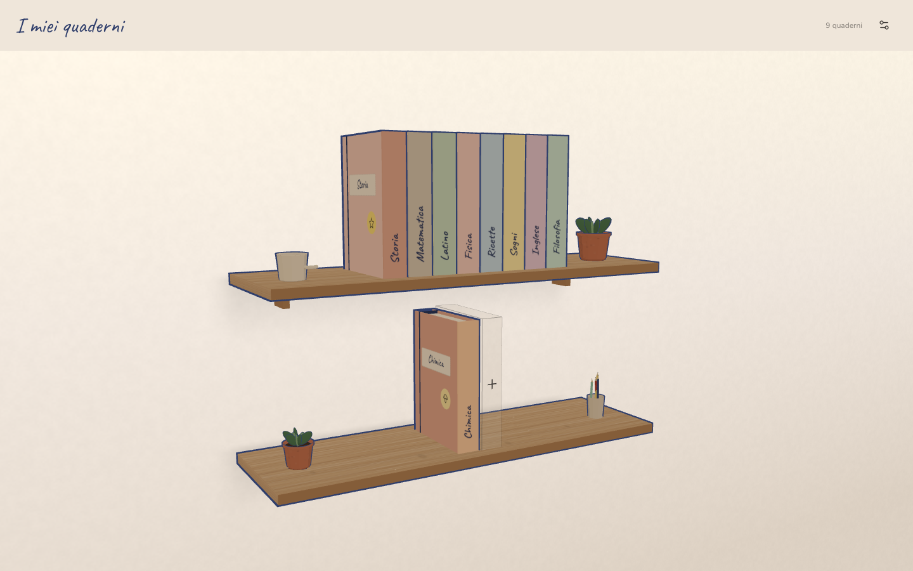

# Il Quaderno degli Appunti dello Studente

Un quaderno di carta che vive nel browser. Zero backend, zero login: tutto resta
in `localStorage`, sul tuo dispositivo.



- **Mensola 3D** con i quaderni in verticale, ognuno con la sua copertina.
  Fallback 2D in CSS se WebGL non c'è o se hai chiesto meno movimento.
- **Quaderno aperto** a doppia pagina su desktop, singola su mobile. Il testo
  cade esattamente sulle righe e, quando la pagina finisce, trabocca sulla
  successiva. Mai una scrollbar dentro la carta.
- **Disegno vettoriale** con matita, penna, pennarello, evidenziatore e gomma.
  Supporto pressione, undo/redo, e i tratti che si ridisegnano all'apertura.
- **Atelier** per costruire il quaderno: dieci colori, sei motivi, dieci
  adesivi, dorso, elastico, tipo di carta. Anteprima dal vivo.
- **Modalità sera**, suoni opzionali, export/import JSON.

## Leggere da vicino

- **Corpo del testo** S/M/L nella barra di scrittura; le righe restano a 32px.
- **Zoom a passi**: lente in alto, `+`/`-`/`Esc`. Tutto → pagina → quarto; le
  frecce scorrono le zone e in fondo girano pagina.

## Sviluppo

```bash
npm install
npm run dev
```

| Script                        |                                                                                                                                                                                  |
| ----------------------------- | -------------------------------------------------------------------------------------------------------------------------------------------------------------------------------- |
| `npm run dev`                 | dev server                                                                                                                                                                       |
| `npm run build`               | type-check + build di produzione                                                                                                                                                 |
| `npm run lint`                | oxlint + prettier --check                                                                                                                                                        |
| `npm run format`              | prettier --write                                                                                                                                                                 |
| `npm run preview`             | serve `dist/` su :4173                                                                                                                                                           |
| `npm run test:e2e`            | Playwright (desktop + mobile)                                                                                                                                                    |
| `npm run audit [url]`         | percorre tutti i casi d'uso su quattro profili e scrive `.audit/report.md` (axe, bersagli, contrasto, console, tempi, bundle); la sintesi con il piano è in [AUDIT.md](AUDIT.md) |
| `npm run debug:portale [url]` | usa l'app come una persona, senza `reducedMotion`, e segnala le violazioni degli invarianti con screenshot in `.debugger/` (default: `http://localhost:4173`)                    |

I test end-to-end richiedono il browser di Playwright:

```bash
npx playwright install chromium
```

## Deploy su Vercel

Il progetto Vercel `quaderno` è collegato a
[github.com/simiriva95/quaderno](https://github.com/simiriva95/quaderno):
ogni push su `main` va in produzione, ogni altro branch ha la sua preview.
Per un deploy manuale:

```bash
vercel --prod
```

`vercel.json` gestisce il rewrite SPA e la cache degli asset. Nessuna variabile
d'ambiente, nessun servizio esterno, nessun database.

## Dove stanno i dati

| Chiave                             | Cosa                                               |
| ---------------------------------- | -------------------------------------------------- |
| `quaderno:v1` (localStorage)       | i quaderni e le pagine                             |
| `quaderno:prefs:v1` (localStorage) | tema, suoni, ultimo strumento                      |
| `quaderno:ui` (sessionStorage)     | pagina corrente, modalità, posizione sulla mensola |

Se lo spazio finisce, l'app lo dice e resta usabile: lo stato vive comunque in
memoria e si può esportare. `Impostazioni → Esporta` produce un JSON con tutto.

## Schermate

`screenshots/` contiene ogni schermata in luce e in sera, su desktop e mobile.
Si rigenerano con `npm run test:e2e`.

## Scelte di design

Tutte documentate, con il perché, in [DESIGN.md](DESIGN.md).
